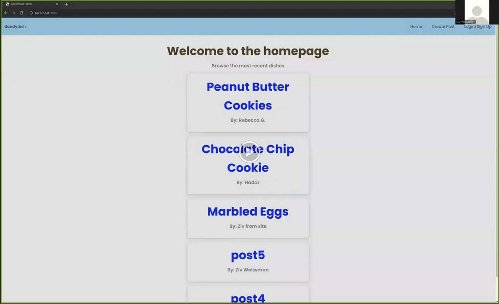

# recipe-site

## Project overview
This was a fun short project I worked on towards the end of spring break. As I'm continuing to develop my full stack software engineering skills as a compliment to my formal CS Education, I decided to develop my express.js backend engineering skills and after completing and studying online curriculum last week, I briefly took an opportunity to practice my new skills on a simple web app demonstrating some of what I've learned.

## Live demo
Tl;dr, click here to view a short video demonstrating me using this web app:

## Notes
1. This is a very basic project only to practice certain advanced topics I had learned last week that I particularly wanted to implement
2. The css for the front-end is grabbed from previous projects I've worked on and had only very minimal changes applied to it for this project
    - The general styling applies to many more html classes that I didn't implement
3. The name "dandydish" was arbitrarily chosen as it was the only name that at the time that I could think of that had an available .com domain.

## Why I'm not executing on this project
For me, the realm of cooking and recipe sharing is not a passion, so I'm not executing on this particular project. Instead, I'm currently in a period of learning and exploration as I prepare for the upcoming academic quarter. During this time, I want to focus my efforts on exploring more challenging ideas in areas that truly ignite my passion. While I hope to complete and share a project I've been working on in parallel, for now, my learning-to-time ratio feels more appropriate for other pursuits. As I shift my direction and efforts towards academic progress and a new project, I look forward to sharing other completed work on the public domain sometime in the future.